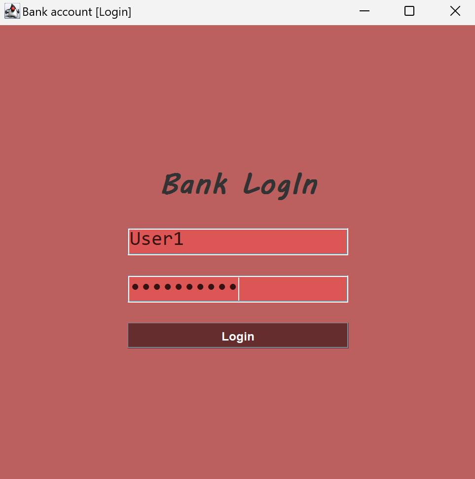
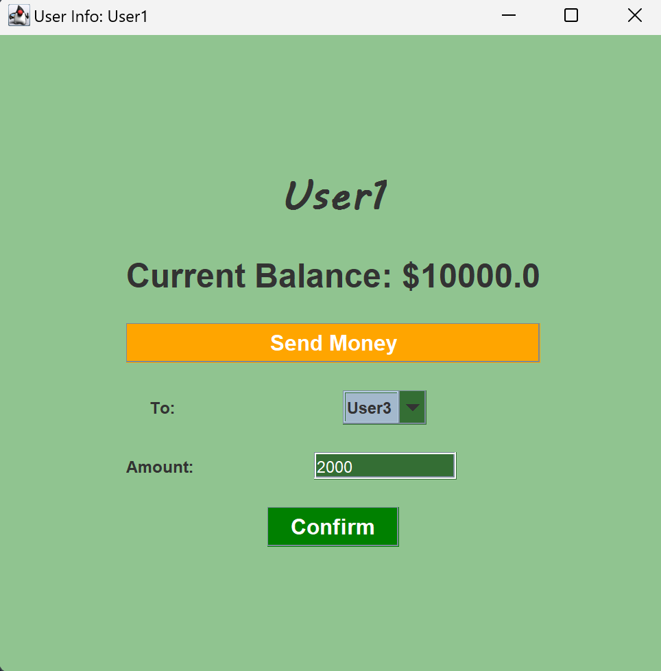

<!DOCTYPE html>
<html lang="en">
<head>
</head>
<body>

<h1>Bank Simulator</h1>

<h2>Overview</h2>

Bank Simulator is a Java program that simulates financial transactions between multiple users, secured by password protection. This application provides a simple and effective way to understand the fundamental concepts of transactions and user authentication, featuring a graphical user interface (GUI) for ease of use.

<h2>Features</h2>
<ul>
    <li><strong>User Registration:</strong> Create new users with a username and password.</li>
    <li><strong>User Authentication:</strong> Secure login mechanism with password protection.</li>
    <li><strong>Transaction Management:</strong> Perform transactions between users.</li>
    <li><strong>Balance Inquiry:</strong> Check the balance of any user.</li>
</ul>

<h2>Installation</h2>
<ol>
    <li><strong>Clone the repository</strong>
        <pre><code>git clone https://github.com/23Benji/Bank-Simulator.git
cd Bank-Simulator</code></pre>
    </li>
    <li><strong>Compile the Java files</strong>
        <pre><code>javac -d out/production/BankSimulator src/*.java</code></pre>
    </li>
    <li><strong>Run the program</strong>
        <pre><code>java -cp out/production/BankSimulator Main</code></pre>
    </li>
</ol>

<h2>Usage</h2>
<ol>
    <li><strong>Create new users and password</strong>
        
Change the existing usernames and passwords with whatever you like. Change it from  <strong>"Main.java" </strong>

        

            
        

    </li>
    <li><strong>Login as an existing user</strong>
        
Enter your username and password in the login window.

        

            
        

    </li>
    <li><strong>Check balance and perform a transaction</strong>
        
Your current balance is displayed upon logging in. You can choose the "Send Money" option to perform a transaction. Follow the prompts to enter the recipient's username and the amount.

        

            
        

    </li>
    <li><strong>Login to multiple users simultaneously</strong>
        
You can log in and check the balance live by simply using the login window.

        
<strong>Attention!</strong> By closing the login window, all other windows will close as well!

        

            
        

    </li>
</ol>
<h2>License</h2>

 This project is open source and licensed under the [<a href="LICENSE" title License>MIT LICENSE.</a>]. See the LICENSE file for details.
 

</body>
